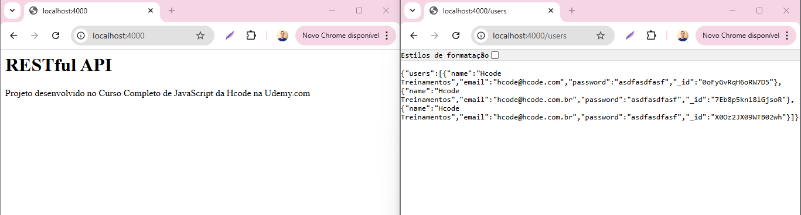
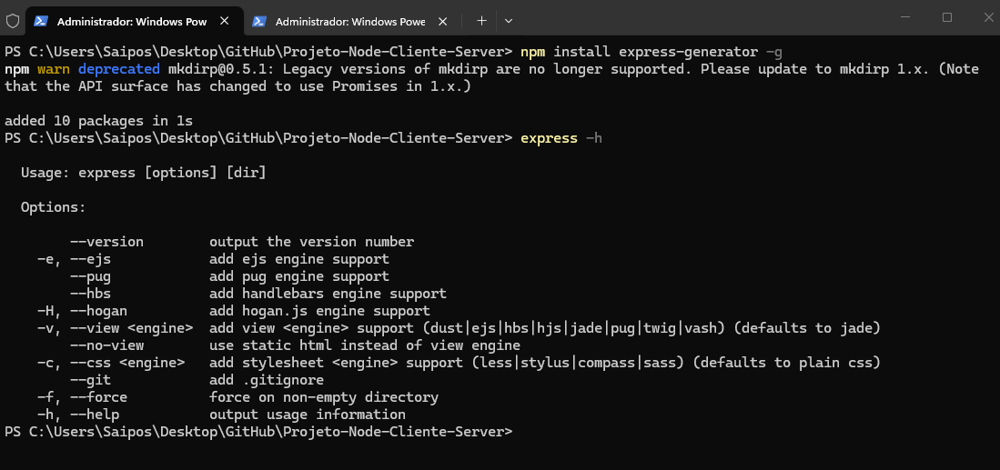

# Curso NodeJS - JavasScript no Back-End (Curso Iniciado)

## 79. U01 - Criando novo projeto com Express Generat
- Instalando o npm install -g bower.
- Baixamos as pastas base para iniciarmos o curso.
-E instalando o bower dentro das pastas para arrumar a formatação da pagina.
-Servidores rodanda.

- Instalmos o express-generator - para habilitar a rodas paginas ao mesmo tempo.

## 80. U02 - Usando Restify para acessar API REST
- Instalando o Restify
- aprendendo Restify - é um framework escrito - web server 
- O Restify é um framework para Node.js focado exclusivamente na construção de APIs RESTful robustas e de alto desempenho

## 81. U03 - Ajax com XMLHttpRequest
- Ajax - tecnologia assincrona (Tudo que é feito no site ele te da um retorno)
- XHR - XML / HTTP Request - Metodo do javaScript por fazer o Ajax rodar.

## 82. U04 - Adequando os dados salvos no servidor RESTful
- Alterei os dados no servidor para que obtenham a forma correta para poder extrair a api

## 83. U05 - Refatorando para uma classe HttpRequest
- Melhorando o codigo de XHR com orientação a objeto deixando mais legivel.
- Crie uma classe HttpRequest para tratar as requisições, agora no meu controle basta eu chamar o método estático da classe passar a URL e então da promessa percorrendo os usuários , criando uma instância dos usuários e adicionando na tela para o cliente.

## 84. U06 - Consumindo Rotas, POST, PUT e DELETE com Restify
- Na pasta routes/users.js criei o restante das rotas para post, delete, put e get para buscar apenas um usuário.

## 85. U07 - Usando Ajax com método POST e PUT
- No metodo save() que esta na classe users, estou retornando uma promise, se o user tiver id realizo o put dele, caso ele não tenha id realizo o post, se a requisição der certo, atualizo os dados dos usuarios com a resposta do servidor. No UserController.js agora o save vai ter o then que recebe o user e executa a inclusão do usuário na tela.

## 86. U08 - Usando Ajax com método DELETE
- No models do user retornei uma promessa do delete, chamo esta promessa no user controller para retornars na tela para o cliente

## 87. U09 - Alterando o limite de bytes enviados por POST
- Ajustai o limite de bytes para que uma foto possa ser enviada para o servidor. (50mb)

## 88. U10 - Refatorando para fetch API
- Mudamos a forma de escrever requisições de ajax para fetch, a troca foi feita para deixar o codigo mais flexivel e robusta para mudanças.